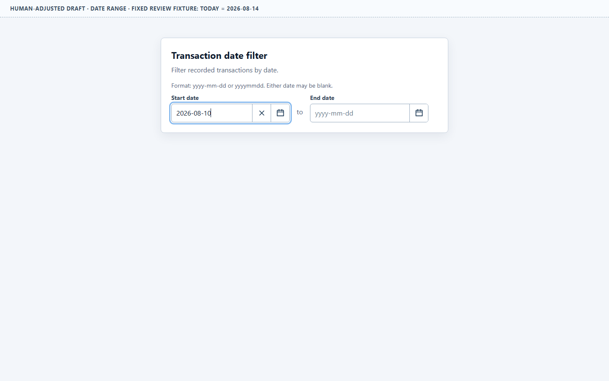
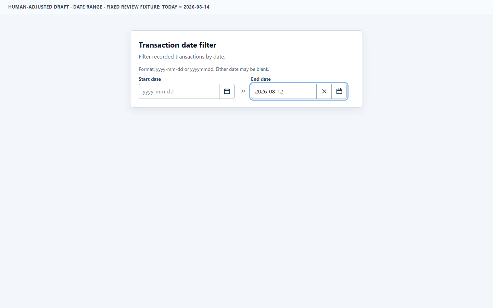
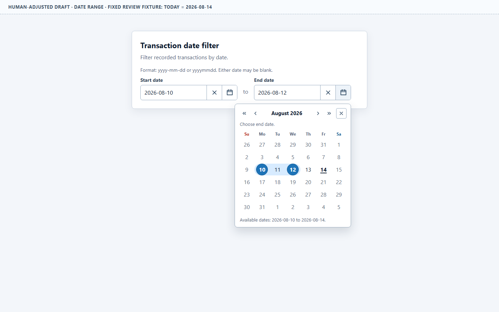
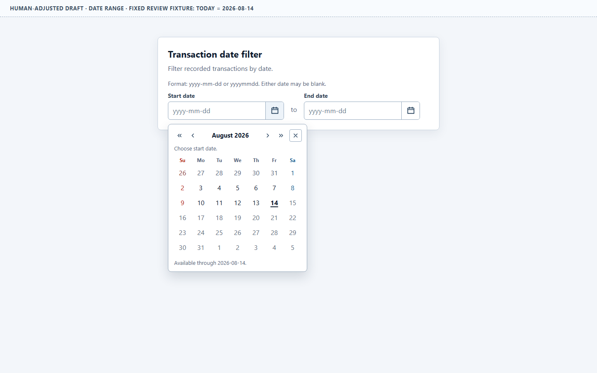
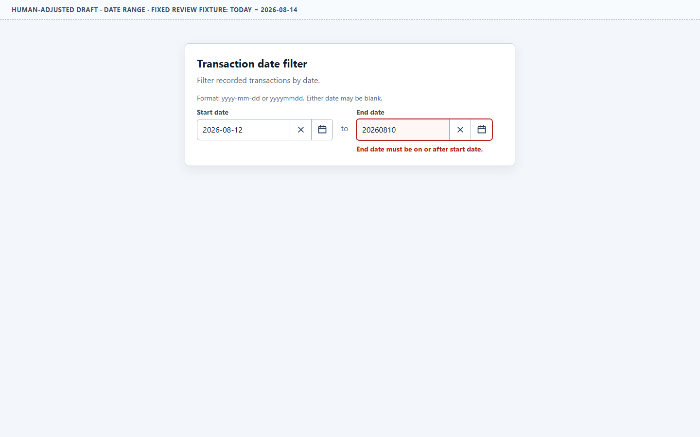

# Date Range Adjustment Review

Status: human-approved on 2026-08-14; fixed as the Phase 2 baseline.

## Open the candidate

- [Adjusted Date range](./adjusted/date-range.html)
- [Accepted adjusted Single date](./adjusted/single-date.html)
- [Original Date range baseline](./baseline/date-range.html)

## Current design

The accepted Single date interaction model is applied independently to each
boundary of a transaction-date filter. This revision rejects the earlier
hotel-style two-click completion model because this task permits either
boundary to remain unspecified.

- Start date and End date are separate, directly labeled editable fields.
- Each field accepts `yyyy-mm-dd` and normalizes `yyyymmdd`.
- Each field is 280 pixels wide; the shared popup is 336 pixels wide.
- Clear and calendar actions are integrated at each field's trailing edge and
  separated by a one-pixel divider. They remain named native buttons outside
  the normal page Tab sequence.
- Input focus opens the calendar. `Tab` closes it and moves between the two
  inputs. Calendar controls remain keyboard-operable after explicit opening.
- One shared six-week calendar provides month/year navigation, Close, Escape,
  disabled future dates, weekend orientation colors, and the fixed-today
  underline inherited from the accepted Single design.
- A calendar click selects only the field that opened the popup and immediately
  closes it. Choosing Start does not silently enter an End-selection mode.
- Start-only and End-only periods are valid. The concise hint states that either
  date may remain blank.
- When both boundaries exist, reopening either picker shows a continuous light
  blue band with solid circular endpoints.
- Unavailable dates use muted text on an unfilled background. They do not reuse
  the filled-tile treatment of the selected range.
- When the opposite boundary exists, out-of-order calendar dates are disabled
  and a short availability sentence states the active boundary.
- Manual input rejects unreal dates, future dates, and End dates before Start.
  Corrections remove the local error without requiring a reset.
- Clearing End preserves Start, so the incomplete operation can resume.

The comparison found two legitimate but different conventions. Reservation
pickers commonly collect both endpoints as one two-click operation and close
after the full range is submitted. Business filters can expose independent
boundaries and allow either one to remain empty. This Reference now models the
second case; it does not claim that the reservation convention is wrong.

Two explicit inputs keep labels, validation ownership, and manual-entry
boundaries visible.
[USWDS](https://designsystem.digital.gov/components/date-range-picker/) uses
separate start and end inputs. [MUI](https://mui.com/x/react-date-pickers/date-range-field/)
supports both single-input and multi-input fields, while its range picker closes
after a full range is submitted. [Ant Design](https://ant.design/components/date-picker/)
exposes `allowEmpty` separately for Start and End. These examples support the
decision boundary rather than prescribing this candidate's exact visuals.

## Representative states

Start selected with one click and the popup closed:

End selected independently with Start blank:

Completed range reopened from End date:

Unavailable dates without range-like fill:

Reversed manual range:

## Human decision

Keep this independent-boundary model as the bounded Date range business-filter
example. One-click closure, Start-only and End-only states, the connected range
band, unavailable-date distinction, error placement, and clear/resume behavior
are accepted for this Reference.

Locale, timezone, responsive/collision behavior, real assistive-technology
behavior, backend validation, production date policy, and canonical adoption
remain outside this adjustment. Target transfer is covered by the separate
Phase 2 result.
