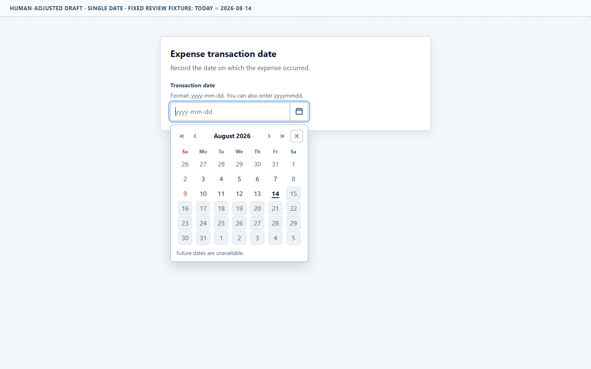
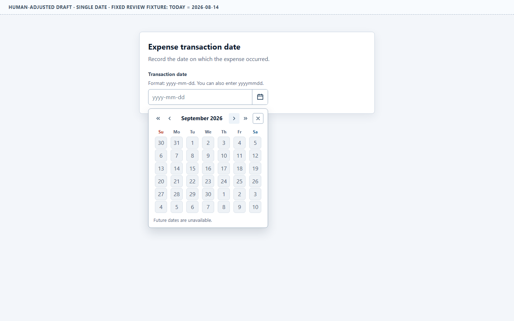
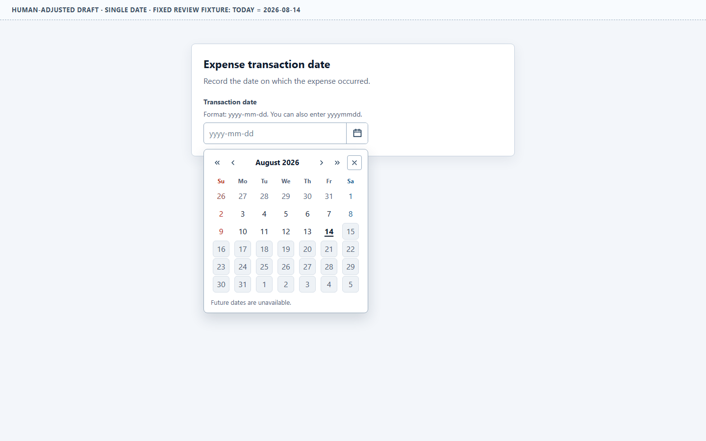
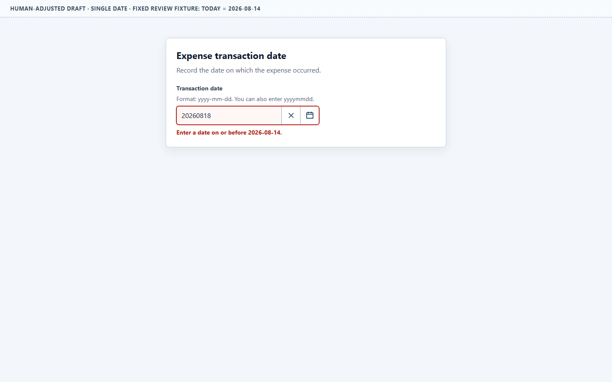

# Single Date Adjustment Review

Status: accepted by the human reviewer on 2026-08-14 as the local basis for the
Date range adjustment. This does not make the design a universal or canonical
DatePicker specification.

## Open the adjusted candidate

- [Adjusted Single date](./adjusted/single-date.html)
- [Original human-calibration baseline](./baseline/single-date.html)

## Current design

The editable field and calendar remain one control group. The product example
is now an expense transaction date so the fixed rule that future dates are
unavailable is coherent with the task.

- The input accepts `yyyy-mm-dd` and normalizes `yyyymmdd`.
- Focusing the input opens the calendar without moving focus away from typing.
- Pressing `Tab` from the input closes the popup before normal focus movement.
- Clear appears before the calendar icon at the trailing edge of the field.
- A one-pixel divider separates Clear from the calendar action without adding
  another color or decorative element.
- Clear and the calendar icon are pointer and assistive-technology actions, but
  are excluded from the page Tab sequence. Keyboard users edit/clear in the
  input and open the calendar with `ArrowDown`.
- The popup shows a complete six-week month grid.
- Sunday and Saturday columns use restrained red and blue text respectively.
  Column position and full weekday names remain available, so color is only a
  supplemental orientation cue. Disabled and selected state styling takes
  precedence over weekend color.
- The popup is 336 × approximately 336 CSS pixels at the acceptance viewport,
  reduced from approximately 404 × 398 pixels without reducing date targets
  below 34 × 34 pixels.
- The editable field group is also limited to 336 pixels. The known ten-character
  date value does not stretch across the form, and the popup remains aligned to
  the field's left edge.
- Separate previous/next month and previous/next year controls are available.
- Dates after the fixed review date, August 14, 2026, are visibly and
  semantically disabled. Selecting a disabled date does not change selection or
  close the popup.
- Manual future input receives a boundary-specific error and can be corrected.
- The popup can be closed with its visible Close action, `Escape`, input Tab
  departure, an outside pointer action, or the field calendar toggle.

## Representative states

Input focus with the full month open:

Next-month navigation with unavailable future dates:

Unavailable future-date state:

Manual future-date rejection:

## Popup-size calibration

The previous 404-pixel-wide popup was large relative to common desktop
examples. The [W3C APG Date Picker Combobox](https://www.w3.org/WAI/ARIA/apg/patterns/combobox/examples/combobox-datepicker/)
example uses a 320-pixel dialog and 40-pixel date cells. The current
[USWDS Date Picker](https://designsystem.digital.gov/components/date-picker/)
caps its calendar at the `mobile` width token, which the
[USWDS spacing tokens](https://designsystem.digital.gov/design-tokens/spacing-units/)
define as 320 pixels. This candidate therefore uses a
nearby 336-pixel width: the additional room retains four navigation actions and
a visible Close action in one header. Its 34-pixel date targets remain above
the [WCAG 2.2 AA target-size minimum](https://www.w3.org/WAI/WCAG22/Understanding/target-size-minimum)
of 24 by 24 CSS pixels.

This is a local calibration, not a universal 336-pixel rule. Short viewports,
zoom/reflow, touch-oriented sizing, and collision handling still require later
evidence.

## Today recovery decision

No Today button is added in this round. A Today action is available in some
systems but is not a consistent desktop default. For example,
[MUI](https://mui.com/x/react-date-pickers/custom-components/#action-bar)
exposes it as an optional action that selects today's value and closes the
picker, while the W3C APG, USWDS, and
[Carbon](https://carbondesignsystem.com/components/date-picker/usage/)
baseline patterns do not prescribe a navigation-only Today button. A button
that only changes the visible month would therefore have different semantics
from a common value-selection action.

The current picker reopens on the selected date, or on the fixed review date
when no value is selected. Closing and reopening is thus a recovery path after
exploratory month/year navigation. Add an explicit `Go to today` action only if
human use shows that this recovery path is insufficient; do not label a
navigation-only action `Today` without clarifying its effect.

The underlined date is the current-date state (`aria-current="date"`). The fixed
review clock is now 2026-08-14, matching the review date, and the harness label
states the fixture in ISO format. The underline is not a selection state.

## Why the inline actions are treated this way

The visual order is not claimed as a universal rule. It keeps the value-local
Clear action nearest the value and the popup affordance at the outer edge.
Both actions remain named native buttons for pointer and assistive-technology
operation. The page Tab sequence contains only the editable combobox, following
the single-stop model illustrated by the WAI-ARIA combobox/date-picker pattern.

## Human decision

The reviewer accepted this adjusted direction, including the full-month
density, month/year controls, disabled-date treatment, weekend orientation
colors, compact popup and field, today treatment, inline action separation, and
single Tab-stop field. The decision authorizes its use as the source design for
the Date range adjustment only.

Locale, timezone, responsive behavior, real assistive-technology behavior,
backend validation, and Target transfer remain outside this adjustment.
