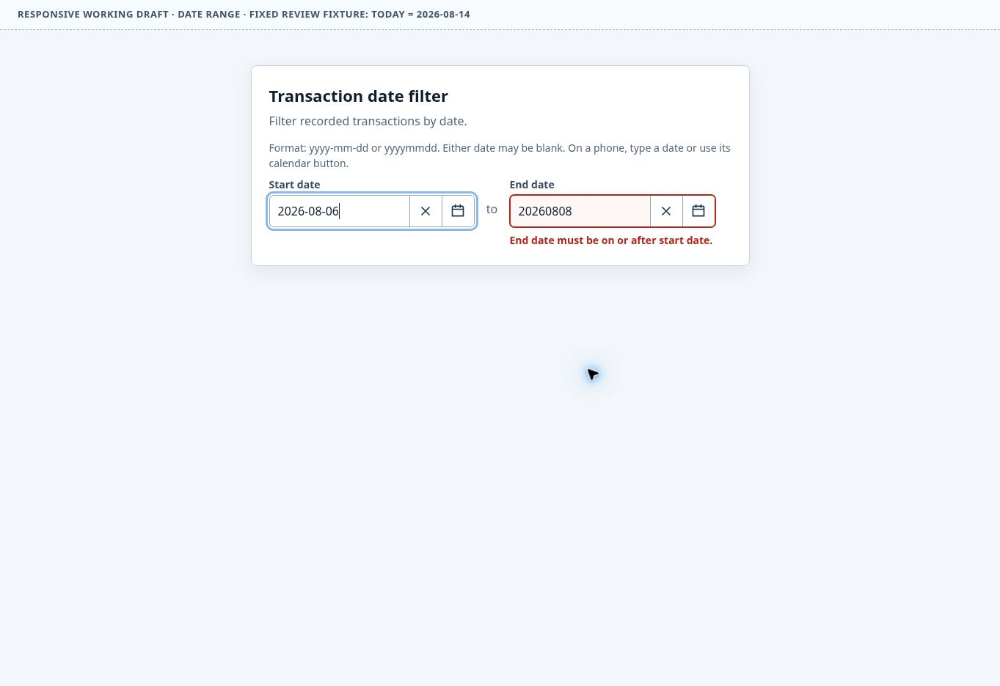

# PoC 019 — AI browser operation review

Issue: [#9](https://github.com/mk3008/torrone/issues/9). Outcome: **bounded value observed; propose a minimal optional integration**, with further evidence required before making it a mandatory Gate. This is verification research, not design approval or a Reference correction.

## Target and method

- Checkout: `05079c1df9713d5ecbea5aeeb147138827526a03` (merged PR #10).
- Approved Reference: `review/references/date-range.html`, blob `d2be91d512ac310cb306adfe0e9bfe556ec2bca8`, with `references/date-range.md` guidance. The page still labels itself a working draft; curation, not that historical banner, determines the approved identity.
- Application requirements: review the bounded filter responsibility, independent boundaries, coherent entry/exit, invalid recovery, and typing/calendar separation. Do not import the different Invoice candidate's Enter or tab-stop policy as a requirement.
- Environment: Chrome through the provided browser interaction API; unframed viewport 1363×936. A separate 390/320/900 CSS-pixel iframe exercised media-query behavior. Fixed today is 2026-08-14, not the run date.
- Date/time: 2026-09-16, 00:35:24–00:37:45 UTC for retained observations. One agent, no independent evaluator or fresh-context claim.
- Actions used rendered roles/names and ordinary click/fill/keypress calls. Read-only DOM observations captured focus, input values, validation/expanded attributes, and rendered snapshots; no private application state or synthetic event dispatch was used.
- A dependency-free Node static fixture served unchanged Reference bytes through the managed preview. An initial Vite installation did not complete and its offline retry lacked the tarball; it was abandoned. No dependency, lockfile or production runtime was added. The final preparer preserves identical Reference bytes and the same width-fixture controls, not the incidental setup attempt.

The review was guided exploration: begin with curation responsibilities, operate happy paths, vary completion/recovery order, inspect unexpected state, then repeat a discriminating failure from a clean reload. No exhaustive scenario generator or large handwritten E2E suite was introduced. Source and previous conversation knowledge were available: this is **not a blind discovery experiment**. In particular, opposite-boundary recovery had already been identified as an ambiguity during PoC 018; this run adds direct evidence on the approved Reference, not a claim to first discovery.

## Results and evidence

[evidence/observations.json](evidence/observations.json) retains 34 timestamped checkpoints (D00–D18 and N00–N14). Names record the actions; [protocol.md](protocol.md) supplies replay order and inputs. The screenshots below are the same bytes inspected during the run. [evidence/manifest.json](evidence/manifest.json) records hashes; this is a single retained run, not a statistical sample.

| Coverage | Observation | Evidence |
| --- | --- | --- |
| Independent calendar completion | Start Aug 10 commits without End; End Aug 12 completes separately; desktop returns to the owning text input. | D01–D04 |
| Manual validation/recovery | Impossible Feb 30 shows an error; correcting the same field clears it. | D05–D06 |
| Opposite-boundary recovery | Start Aug 10 → End Aug 8 (invalid) → Start Aug 6 leaves End marked invalid with a now-stale ordering error. Reconfirming unchanged End repairs it. A clean reload reproduces the stale error. | D07–D09, D18; screenshot below |
| Partial ranges / Clear | Clearing Start leaves valid End-only; clearing End leaves valid Start-only, including recovery from an invalid future date. | D10, N11, N13–N14 |
| Native sequential navigation | Tab from Start reaches End; Shift+Tab returns to Start, skipping the Reference's non-tabbable action buttons. Popup state differs between the two observed directions; neither result is claimed to satisfy the Invoice candidate's policy. | D11–D12 |
| Calendar keys and exit | ArrowDown enters the day grid, ArrowLeft moves a day, Enter selects; Close and reopen-opposite/Escape restore the owning input. | D13–D17 |
| Narrow typing vs calendar | Text focus alone leaves calendar closed; explicit open moves focus into it; selection and Close return to the owning calendar button. | N00–N04 |
| Width / method interruption | 390→900→320 changes close the calendar, preserve the value, and allow reopening. Clicking the other text field closes the calendar. Measured document scroll width does not exceed frame width at those checkpoints. | N05–N10 |
| Clear then reselect | After clearing End, reopening and choosing Aug 12 commits it correctly. | N11–N12 |

### Finding requiring design/behavior follow-up

**Confirmed observation, recovery-policy decision needed:** D08 and D18 show a displayed Start of Aug 6 and End of Aug 8 while the error says End must be on or after Start. The DOM also reports End invalid and the selection announcement treats End as absent. D09 confirms that recommitting the same End value clears the error.

The expectation of a credible recovery path comes from the curated Preserve guidance; the exact requirement to revalidate the other boundary immediately is not explicit there. This is actionable evidence of stale feedback and an unresolved commit/revalidation policy, not permission to rewrite the approved design. Follow-up should decide when dependent fields revalidate, clarify the guidance, and verify the same sequence plus its symmetric case in a draft correction. This PR leaves the approved executable, its approval record, and Invoice candidate unchanged.

## Incremental value and limitations

| Evaluation | Conclusion |
| --- | --- |
| Beyond static checks | Hashes/source inspection can establish identity and suggest the recovery mechanism, but do not observe actual event delivery, focus return, rendered errors, or recovery after a particular click/key sequence. This run adds those observations and a reproducible screenshot. It does not prove static analysis could never find the issue. |
| Exploratory / sequence value | The same-field recovery path passed; repairing the opposite boundary retained a stale error. Repeating after reload distinguishes a reproducible sequence from a transient capture. The sequence was informed by prior knowledge, so novel-discovery value remains unmeasured. |
| Behavior coverage | Selection, completion, invalid recovery, Clear, focus/keyboard paths and narrow layout were observed. Month/year navigation, rapid races, exhaustive interruption combinations, all ranges, assistive technology and other browsers were not covered. |
| False positives | The fixed historical date, working-draft banner and differing Reference/Invoice policies are not classified as new runtime bugs. Body focus after clicking an external width button is contaminated by the fixture's own focus transfer; it is not evidence that device rotation loses focus. |
| False negatives / unknowns | No seeded-defect or independent review set was used, so precision/recall cannot be estimated. Real mobile keyboard occlusion, IME action delivery, touch event order, orientation with retained focus, and intermittent paint defects remain unverified. An iframe is not phone emulation. |
| Cost / maintenance | 34 checkpoints, two screenshots, about 2m20s of retained browser observations, plus several minutes of setup and analysis. No token/API-cost measurement. One small reusable preparer and a replay protocol; no per-Reference production test framework. Environment setup remains a material cost. |
| Reproducibility | Exact Reference identity, fixture preparation, ordered inputs and timestamped results are retained. The stale-error case reproduced twice in one session. Cross-session, cross-browser and independent-agent reproducibility remain unknown. |

## Decision

Add a **small optional evidence pass** to the existing review loop when dynamic behavior or a known interaction risk warrants it: identify the Reference/requirements, operate a bounded happy path plus a discriminating order change, retain observations, and report gaps separately from approval. The run supports this limited use; it does not justify a mandatory universal Gate, a new architecture, permanent browser dependency, or automatic design approval.

Stop this experiment after the reproduced recovery discrepancy and representative interaction coverage; additional arbitrary sequences would not change that adoption decision. The next useful evaluation is an independent run or a real-device case, not a larger unbounded sweep of this fixture. A concrete Reference correction is a separate review decision.
